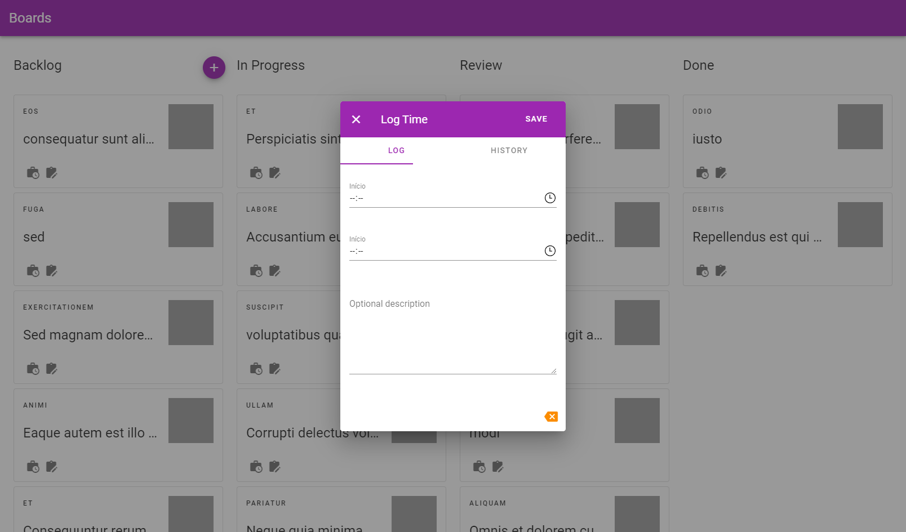

# Neutralize Boards

## Project setup dev
```
npm install
npm api:dev
npm run serve
```

## Technologies

- VueJS
- TypeScript

> APIs with [`json-server`](https://www.npmjs.com/package/json-server) and [`faker`](https://www.npmjs.com/package/Faker) to generate fake data.

## Preview

